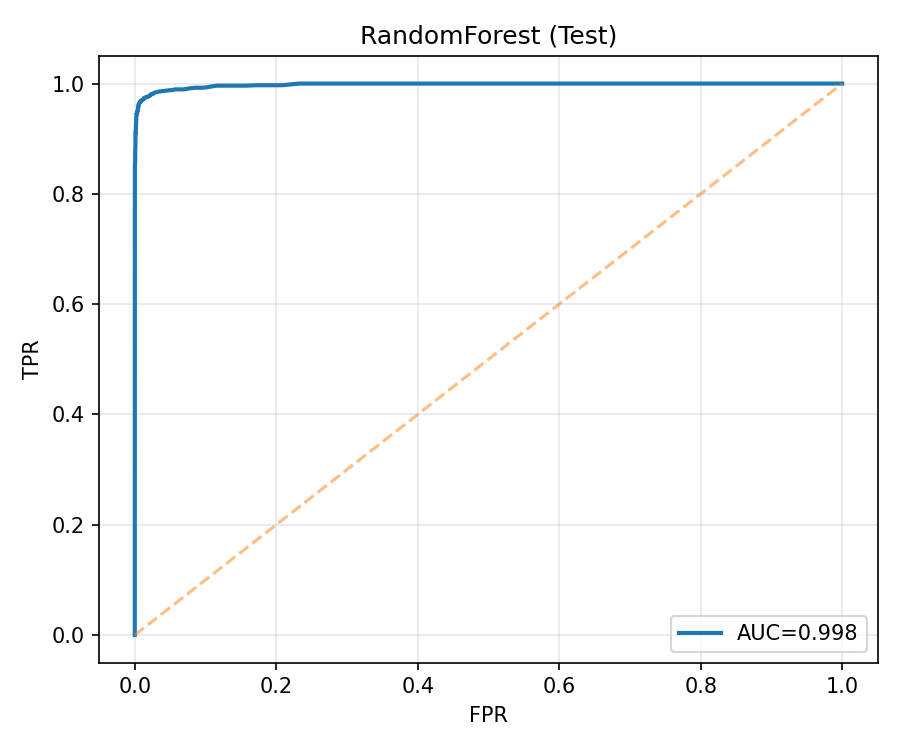

# Chasing Dirty Coins: An AML Graph Project  (•̀ᴗ•́)و

Can we **catch money launderers** using **machine learning + network science**?

---

## Why this project?

Illicit financial flows are increasingly complex, and transaction networks provide a natural testbed for studying them.  
This project uses the **Elliptic Bitcoin Dataset** to:

- Visualize how suspicious funds may flow through transaction graphs  
- Engineer graph-based features (e.g. centrality, embeddings, temporal splits)  
- Train baseline models to classify illicit vs. licit transactions  
- Explore graph neural networks (GNNs) and anomaly detection for unlabelled cases  

**Research question:**  
To what extent can graph-based methods (embeddings, GNNs) provide incremental predictive power for AML detection beyond traditional tabular features?  

**So far:**  
- Random Forest on tabular features achieves strong performance (PR-AUC≈0.99), though results are affected by class imbalance.  
- Initial graph embeddings (Node2Vec with SVD) added little beyond tabular features.  

**Next steps:**  
- Implement temporal GNNs to capture evolving laundering patterns  
- Compare hybrid models (tabular + graph) to assess real incremental value


## Quick Facts 

 **Dataset**: 203k transactions, 234k edges, 166 features  
 **Challenge**: Only ~3% illicit → heavy imbalance  
 **Graph**: 49 connected components, focus on LCC  
 **Feature Engineering**: Dropped 46 highly correlated columns  
 **Split**: Time-based (70/10/20) to avoid data leakage  

---

## 📊 Results (so far)

Here are some key insights and visualizations from the first two notebooks:

### 1. Class Distribution
Illicit transactions are **heavily underrepresented** (~3%), while most transactions are unknown.  
This highlights the **imbalance challenge** typical in fraud detection.  


---

### 2. Transaction Network Structure
We analyze the graph of 203k nodes and 234k edges:  

| Top-100 Hubs (Graph Subnetwork) | Degree vs PageRank (log-log) |
|---------------------------------|-------------------------------|
|  |  |

**What these show:**
- **Top-100 Hubs:** highlights the most connected transactions and their 1-hop neighborhoods, showing how laundering activity often clusters around a few "super-nodes".  
- **Degree vs PageRank:** strong positive correlation; high-degree nodes tend to dominate PageRank influence, but outliers may indicate hidden intermediaries.  

  These visualizations confirm the **scale-free nature** of the transaction graph and motivate the need for advanced graph-based models.
---

### 3. Feature Correlation Deduplication
We removed **46 highly correlated features** (threshold > 0.98), reducing redundancy and improving model stability.  

| Before Deduplication | After Deduplication |
|----------------------|---------------------|
|  |  |

---

### 4. Time-based Split (70/10/20)
We split the dataset by **time steps** to avoid data leakage:  

- **Train:** 29,936 licit / 2,659 illicit  
- **Valid:** 4,096 licit / 560 illicit  
- **Test:** 7,987 licit / 1,326 illicit  

This ensures future transactions are never used to predict the past.  

---

> Note: Due to file size limits, raw data files are **not included** in this repository.  
> Please download `elliptic_txs_features.csv` from the original Kaggle dataset and place it in `data/raw/`.

### 5. Baseline Modeling 
We trained **Logistic Regression** and **Random Forest** as baselines.  
Thresholds were tuned on validation for best F1, then tested on the full and late-period splits.

**Test performance (tuned thresholds):**

| Model | PR-AUC | ROC-AUC | Precision (illicit) | Recall (illicit) | F1 (illicit) |
|-------|-------:|--------:|---------------------:|-----------------:|-------------:|
| Random Forest | **0.9912** | **0.9978** | 0.970 | 0.959 | **0.964** |
| Logistic Regression | 0.7609 | 0.9659 | 0.691 | 0.876 | 0.772 |

- **Random Forest** is a strong, production-ready baseline.  
- **Logistic Regression** remains a stable, interpretable reference.

<p align="center">
  
  
  
</p>


---

6. Graph-based Modeling (Notebook 4)

We explored graph structure with **Node2Vec embeddings** (128 dimensions).  
Since `karateclub` was unavailable in the current environment, we used a fallback (`node2vec` package + SVD backup).  

**Embeddings visualization:**

| PCA (2D) | t-SNE (2D) |
|----------|------------|
|  |  |

- **PCA:** embeddings collapse towards the origin, showing limited separation under the SVD fallback.  
- **t-SNE:** small clusters emerge, with licit/illicit mixed but some peripheral groups suggesting latent structure.  

**Quick baseline with embeddings vs tabular features:**

| Model Variant           | Valid PR-AUC | Test PR-AUC | Test ROC-AUC |
|--------------------------|--------------|-------------|--------------|
| Embeddings only (SVD)    | 0.121        | 0.142       | 0.500        |
| Tabular only (121 feats) | 0.710        | 0.761       | 0.966        |
| Tabular + Embeddings     | 0.709        | 0.760       | 0.966        |

- **Embeddings-only ≈ random** → expected with SVD fallback, no clear illicit/licit separation.  
- **Tabular features dominate** → strong predictive signal already captured.  
- **Fusion (Tabular + Embeddings)** → no improvement under fallback embeddings.  

**Key Insight:**  
Despite the rich graph structure, tabular features alone already capture most predictive signal.  
Preliminary Node2Vec embeddings (SVD fallback) add **no measurable gain**.  
This suggests:  
- Either laundering activity is encoded in temporal/tabular patterns more than topology, or  
- Better graph representation learning (random walks, temporal GNNs) is required to surface graph signal.

---

**Future Directions (towards a publishable study):**
- Robust Node2Vec/DeepWalk experiments with hyperparameter sweeps
- Temporal GNNs (TGAT, TGN) to explicitly model evolving laundering dynamics
- Comparative benchmark: Tabular ML vs Static Graph vs Temporal Graph
- Semi-supervised anomaly detection for high-risk unknown transactions

---

> *So far, baselines confirm: tabular features are highly predictive; SVD embeddings alone are weak. Proper random-walk embeddings and GNNs are needed to unlock additional graph signal.*


## Data Setup

To run this project, you need to manually download the dataset:

1. Go to [Kaggle: Elliptic Bitcoin Dataset](https://www.kaggle.com/datasets/ellipticco/elliptic-data-set)  
2. Download the `.zip` file and extract it  
3. Place the extracted `.csv` files into:

```
data/raw/
```

---

## 🧠 What's inside?

```
elliptic-aml-analysis/
├── data/
│   ├── elliptic_bitcoin_dataset/        <- CSVs (features, labels, edges)
│   └── raw/                             <- Original downloaded zip
├── notebooks/
│   ├── 01_exploration.ipynb             <- Data deep dive & network intuition
│   ├── 02_preprocessing.ipynb           <- Feature crafting & graph building
│   ├── 03_modeling.ipynb                <- ML pipelines & classification
│   ├── 04_graph_models.ipynb            <- Graph embeddings & GNN experiments
│   └── 05_anomaly_detection.ipynb       <- Semi-supervised & outlier detection
├── scripts/
│   ├── utils.py                         <- Custom helpers & metrics
│   ├── preprocessing.py                 <- Cleaning, feature selection, splitting
│   ├── models.py                        <- Training pipelines & evaluation
│   └── visualization.py                 <- Plots (heatmaps, ROC, confusion matrix)
├── reports/
│   ├── figures/                         <- Key visualizations
│   └── summary.md                       <- Reflective notes & insights
├── requirements.txt                     <- Dependencies
├── .gitignore                           <- Keeps repo clean
└── README.md                            <- You are here

```

---

## Notebook Overview

### **01_exploration.ipynb** – *Data Deep Dive & Network Intuition*
- Load dataset, inspect distributions, and explore temporal structure  
- Build a **transaction graph** with NetworkX  
- Calculate basic graph statistics (degree, connected components)  
- First visualizations of illicit vs licit transaction patterns  

---

### **02_preprocessing.ipynb** – *Feature Crafting & Graph Building*
- Clean raw CSVs and handle missing values  
- Merge features, labels, and edge lists  
- Engineer time-based and aggregated graph features  
- Output processed dataset for modeling  

---

### **03_modeling.ipynb** – *ML Pipelines & Classification*
- Train baseline models: Logistic Regression, Random Forest, XGBoost  
- Evaluate with Precision, Recall, F1, AUC  
- Feature importance analysis for explainability  
- Build reproducible sklearn pipeline  

---

### **04_graph_models.ipynb** – *Graph-based ML & GNN Experiments*
- Generate graph embeddings (Node2Vec, DeepWalk)  
- Hybrid modeling: embeddings + tabular features  
- Implement **GNNs** (GraphSAGE / GCN) in PyTorch Geometric or DGL  
- Compare ML-only vs graph-enhanced models  
- Visualize embeddings with t-SNE  

---

### **05_anomaly_detection.ipynb** – *Unknown-class & Rare-pattern Detection* *(planned)*
- Semi-supervised learning (Label Propagation, Label Spreading)  
- Outlier detection on embeddings (Isolation Forest, LOF)  
- Time-aware anomaly scoring to detect evolving laundering patterns  
- Identify high-risk **unlabeled** transactions  

---

## About the Dataset

- **Nodes:** 203,769 transactions  
- **Edges:** 234,355 transaction links  
- **Features:** 166 anonymized attributes per node  
- **Labels:**  
  - `1` = illicit  
  - `2` = licit  
  - `0` = unknown  
  
---

📖 Academic Note:  
This project serves both as a **portfolio artifact** and a **research seed**.  
It bridges industry AML use cases (production-ready baselines) with academic questions (graph learning vs tabular ML).  
It is being prepared as a foundation for potential MSc/PhD research proposals in **Crime Science / FinCrime Data Science**.


---

## How to Run It Locally

1. **Create environment**
```bash
python3 -m venv elliptic-env
source elliptic-env/bin/activate
pip install -r requirements.txt
```

2. **Start Jupyter Notebook**
```bash
jupyter notebook
```
Then open `01_exploration.ipynb` and follow the sequence.

---
## 🚧 Project Status (ง •̀_•́)ง

- ✅ 01_exploration.ipynb – completed (graph structure, class distribution, LCC visualization)  
- ✅ 02_preprocessing.ipynb – completed (feature cleaning, deduplication: dropped 46 correlated columns, time-based split)  
- ✅ 03_modeling.ipynb – in progress  
- ⏳ 04_graph_models.ipynb – planned  
- 🔜 05_anomaly_detection.ipynb – planned  

---

## License
MIT License — Use it, extend it, and fight crime with it.  

> **"Graph theory meets criminal intent — one transaction at a time."**
